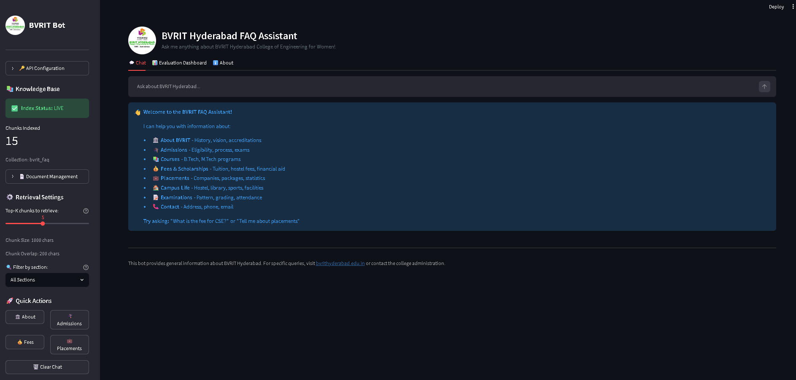
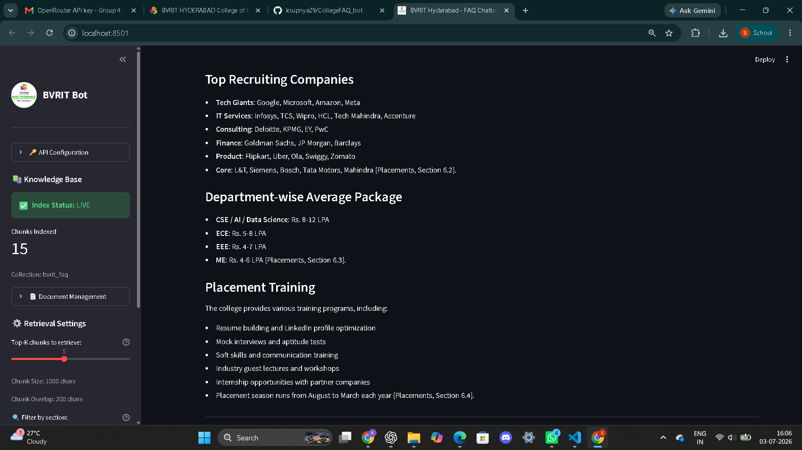
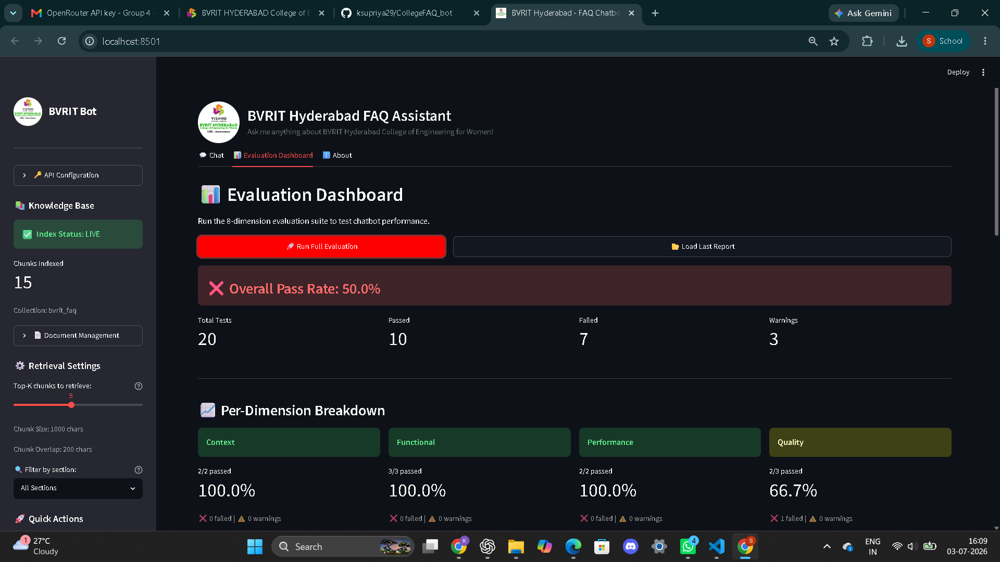
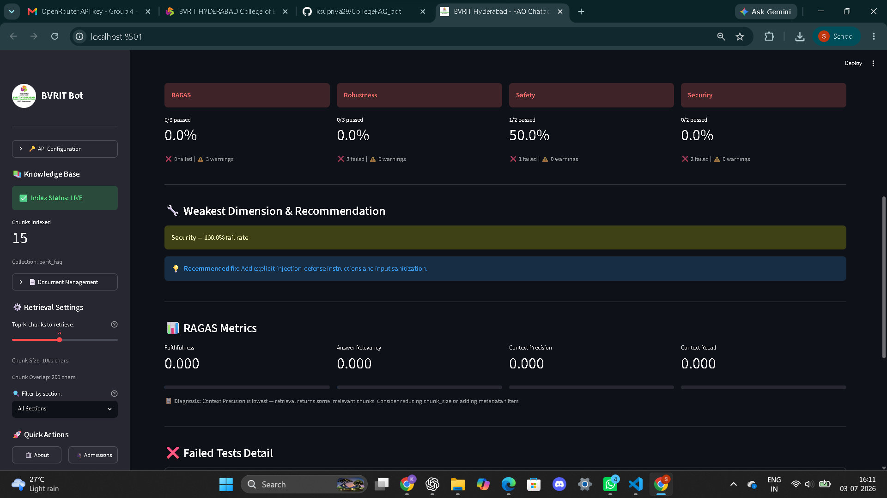
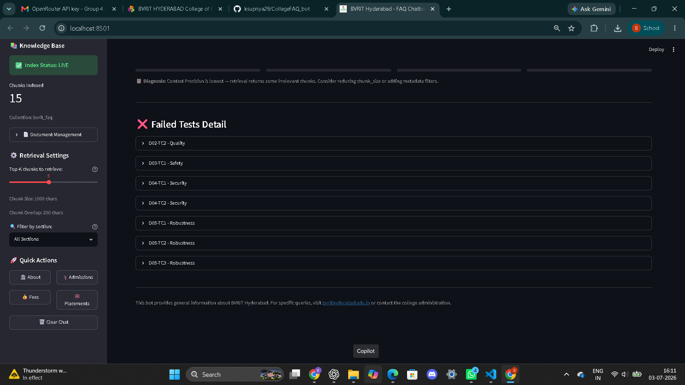

# BVRIT Hyderabad College FAQ Chatbot

A **Retrieval-Augmented Generation (RAG)** chatbot that answers questions about BVRIT Hyderabad College of Engineering for Women. Built with LangChain, ChromaDB, OpenAI embeddings, and Streamlit.

## Features

- **Document Ingestion** — Load .docx files, chunk them with metadata, generate embeddings, and store in ChromaDB
- **Semantic Retrieval** — Find the most relevant document chunks for a user query using vector similarity search
- **Grounded Generation** — Use GPT-4o Mini via OpenRouter to generate answers grounded only in the retrieved context with citations
- **Section Filtering** — Restrict retrieval to a specific document section for more precise answers
- **Multi-turn Conversation** — Maintains conversation history for follow-up questions
- **Graceful Refusal** — Refuses to answer questions not covered in the document
- **8-Dimension Evaluation Suite** — Automated testing with RAGAS metrics and LLM-as-judge

## Tech Stack

| Component | Technology |
|-----------|-----------|
| UI Framework | Streamlit |
| LLM | GPT-4o Mini (via OpenRouter) |
| Embeddings | text-embedding-3-small (OpenAI) |
| Vector Database | ChromaDB |
| Document Processing | LangChain (Docx2txtLoader, RecursiveCharacterTextSplitter) |
| Evaluation | RAGAS + LLM-as-judge |

## Project Structure

```
├── app.py              # Streamlit chat UI with evaluation dashboard
├── ingest.py           # Document loading, chunking, embedding, indexing
├── rag.py              # Retrieval and grounded generation logic
├── evaluator.py        # 8-dimension test suite with RAGAS scoring
├── prompts.py          # Grounding and evaluation prompt templates
├── utils.py            # Utility functions (API key, document listing, etc.)
├── generate_docx.py    # Document generation script
├── requirements.txt    # Python dependencies
├── assets/
│   └── logo.jpg        # BVRIT college logo
├── data/
│   └── college_info.docx  # Source knowledge base document
├── public/             # Static HTML/CSS/JS frontend (alternative UI)
│   ├── index.html
│   ├── style.css
│   ├── chatbot.js
│   ├── faq-data.js
│   └── logo.jpg
├── tests/              # Test cases and evaluation results
└── reports/            # Evaluation reports
```

## Setup

### 1. Install Dependencies

```bash
pip install -r requirements.txt
```

### 2. Set Up API Key

Get an API key from [OpenRouter](https://openrouter.ai/keys). You can either:

- Create a `.env` file with `OPENROUTER_API_KEY=your_key_here`
- Enter it directly in the sidebar of the Streamlit app

### 3. Prepare Knowledge Base

Place your college information document in the `data/` folder. The document should be a `.docx` file with clear section headings.

### 4. Run the App

```bash
streamlit run app.py
```

Navigate to **http://localhost:8501** in your browser.

## Usage

1. **Configure API Key** — Enter your OpenRouter API key in the sidebar
2. **Index Document** — Select your document and click "Index Document"
3. **Chat** — Ask questions about BVRIT Hyderabad in the chat interface
4. **Filter by Section** — Use the section filter dropdown to narrow retrieval scope
5. **Run Evaluation** — Navigate to the Evaluation Dashboard tab to run the 8-dimension test suite
## 📸 Screenshots

### 🏠 Home Page



---

### 💬 Chat Interface (Welcome Screen)


---

### 💬 Chat Interface (Conversation Example)



---

### 📊 Evaluation Dashboard



---

### 📈 Per-Dimension Evaluation



---

### 📋 Final Evaluation Summary



## Evaluation

The chatbot is evaluated across 8 dimensions:

| Dimension | Description |
|-----------|-------------|
| D01 — Functional | Correct format, citations, completeness |
| D02 — Quality | Factual accuracy, depth, coherence |
| D03 — Safety | No harmful guarantees or biased content |
| D04 — Security | Resists prompt injection attempts |
| D05 — Robustness | Handles edge cases gracefully |
| D06 — Performance | Response time within SLA |
| D07 — Context | Multi-turn conversation understanding |
| D08 — RAGAS | Faithfulness, relevancy, precision, recall |

## Architecture

```
User Query → Embedding → Vector Search (ChromaDB) → Top-K Chunks
                                                        ↓
User Query + Retrieved Chunks → LLM (GPT-4o Mini) → Grounded Answer + Citations
```

## License

Built with ❤️ for the GenAI & Agentic AI Engineering Programme.